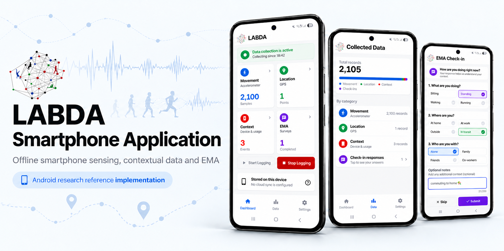

# LABDA

LABDA is an Android research application for collecting phone-based movement, location, device-context, and ecological momentary assessment (EMA) data.

> LABDA is a research prototype. It is not a medical device and does not diagnose, treat, cure, or prevent any medical condition.

## Current functionality

- Start and stop a foreground data-collection service from the dashboard.
- Record phone accelerometer samples and GPS locations while collection is active.
- Record configurable device-context observations, including battery, screen, charging, Wi-Fi, signal, audio output, activity recognition, steps, light, and proximity.
- Schedule and record short EMA check-ins.
- Review collection counts, EMA history, permissions, and per-category collection settings.
- Keep collected records in the app's private on-device Room database.

LABDA does not currently integrate with Health Connect, Google Fit, Wear OS Health Services, or other wearable platforms.

## Data storage and privacy

The current implementation stores records locally in `DataLoggerApp_Dev.db`, inside the app's private storage. Android backup is disabled.

No cloud upload, server synchronization, or built-in data export is configured in this version. The dashboard and in-app study information identify the storage mode as local-only.

Before using LABDA in a study, the study owner is responsible for appropriate participant information, consent, ethics approval, data-retention rules, and a secure extraction or transfer procedure.

## Permissions

LABDA requests only permissions used by its current collection features:

- Notifications, for the foreground service and EMA prompts.
- Fine, coarse, and background location, for GPS collection.
- Activity recognition, for physical-activity classification and the phone step counter.
- Foreground-service, wake-lock, and network-state permissions needed by continuous collection. LABDA may optionally direct participants to Android battery-optimization settings, but does not request a direct exemption.
- Internet and Wi-Fi state, used by Google Play services location and activity recognition and for Wi-Fi context observations.

Participants can stop collection, disable individual categories, skip EMA prompts, and review permissions from Settings.

## Technology

- Kotlin
- Jetpack Compose
- Room
- WorkManager
- Google Play services Location and Activity Recognition
- Android foreground services

The application targets Android API 36, has a minimum SDK of API 29, and uses the Gradle 8.11.1 wrapper.

## Repository structure

```text
app/
  schemas/                 Versioned Room schemas used by migration tests
  src/main/                Application code and resources
  src/test/                JVM unit tests
  src/androidTest/         Instrumentation and migration tests
scripts/
  device_smoke_test.ps1    Physical-device verification harness
gradle/                    Gradle wrapper and version catalog
```

## Build

Use Android Studio or the checked-in Gradle wrapper.

On Windows:

```powershell
.\gradlew.bat :app:assembleDebug
```

On macOS or Linux:

```sh
./gradlew :app:assembleDebug
```

The release build is intentionally not tied to a checked-in signing key. Configure release signing outside the repository when producing a distributable APK or Android App Bundle. Never commit keystores or signing credentials.

## Verification

Run the non-device checks:

```powershell
.\gradlew.bat :app:test :app:lintDebug :app:assembleDebug :app:assembleRelease :app:assembleDebugAndroidTest
```

The instrumentation suite is compiled by `:app:assembleDebugAndroidTest`, but executing it requires an Android device or emulator.

For the full physical-device matrix:

```powershell
powershell -ExecutionPolicy Bypass -File .\scripts\device_smoke_test.ps1
```

The smoke-test harness installs test artifacts, clears or changes test app state, grants test permissions, and writes ignored evidence under `smoke_test_results/`. Use only on a dedicated test device.

## Third-party software

LABDA bundles the Inter font. Inter is licensed under the SIL Open Font License 1.1. See [THIRD_PARTY_NOTICES.md](THIRD_PARTY_NOTICES.md) and [LICENSES/Inter-OFL-1.1.txt](LICENSES/Inter-OFL-1.1.txt).

## Project license

LABDA is source-available under the PolyForm Noncommercial License 1.0.0. It may be used, modified, and redistributed for non-commercial purposes. Commercial use requires a separate written license.

For commercial licensing inquiries, contact the repository owner.
